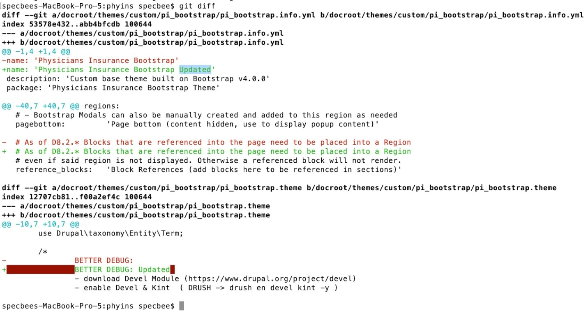
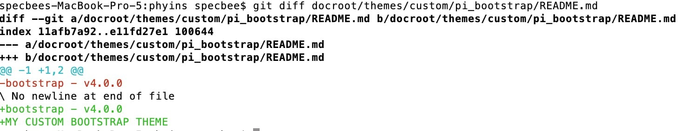
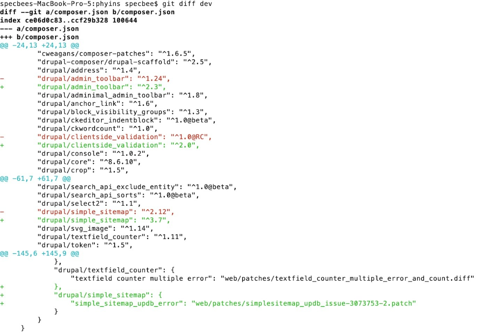
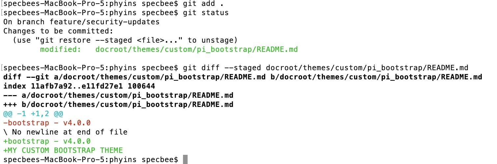
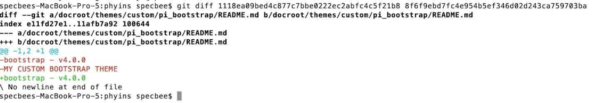
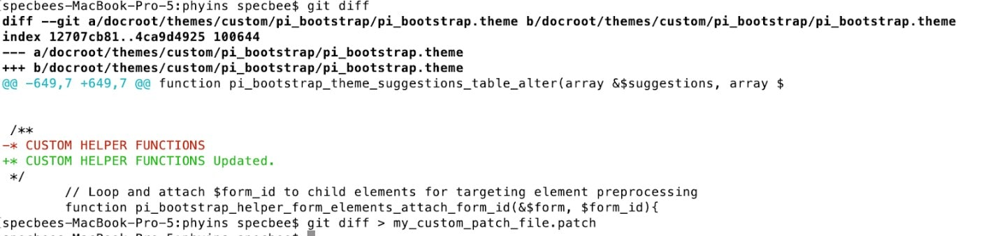
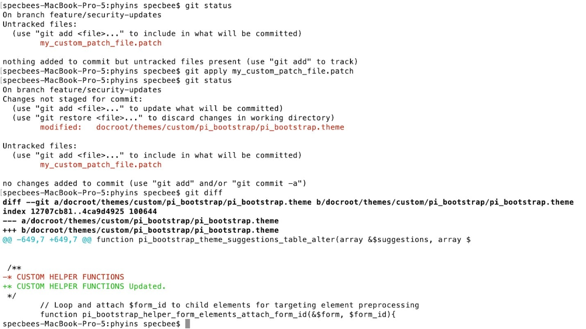

If you’re a Drupal developer, you should be familiar with patches already. Patches are like band-aids. They are small pieces of code that are added on top of already existing code files to support it or to fix any issues. Different types of patches include bug fixes, security vulnerability fixes, performance enhancements, styling fixes, etc. If you are a regular contributor to the Drupal project, you should know that to fix an issue in Drupal core or contributed modules, you need to submit a patch to an issue in the issues queue. These patches are then examined and tested by the module maintainer and applied if found beneficial. There are different ways to apply Git patch.

## What does the Git Diff command do? 
Git diff is a command used to output the changes between two sources inside the git repository. The data sources can be two different branches, commits, files, etc.
The common use cases of git diff commands are listed below.

## $ git diff 
-  This command will output all the modified changes which are not added to git or staged.
 

## $ git diff filename
- This will output the changes of that current file to its previous committed state.
 

## $ git diff branch_name
- This will output the modifications of the current branch to the mentioned branch to its previous committed state.
 

## $ git diff --staged path/to/file
- Once the changes are added to Git or moved to staging, you will not be able to see the diff of the files. To see the staged changes, you can use diff with --staged or --cached option.
 

## $ git diff commit_id1 commit_id2
- To see the difference between any two commits you can use this git diff command where you need to mention the two commit ids. 
 

- If you want to see the list of commits made in the Git repo, use the command $ git log. This will list out all the commits (starting from the latest commit) along with their respective commit ids, the author (developer) and the date it was committed on.

## Creating a Git patch with git diff
- To create a Git patch, we can use any of the git diff commands to get the changes. We then need to save the changes to a file which can be used as below.
 

## $ git diff > my_custom_patch_file.patch
 

## Apply the Git Patch 
Drupal developers will want to apply Git patches frequently to update changes or to fix bugs. Developers will create a patch file which can be used by other developers according to their need. To apply a git patch to the current branch use the following command.
 

- $ git apply patch_file.patch
  

Helper Link:
- https://www.specbee.com/blogs/how-create-and-apply-patch-git-diff-and-git-apply-commands-your-drupal-website
- https://www.specbee.com/blogs/how-create-and-apply-patch-git-diff-and-git-apply-commands-your-drupal-website